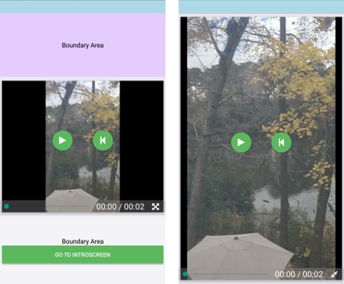

The react-native-video-player-no-linking component is built using the Expo video player and is suitable for use in Expo projects.

.

Click below to see a demo of the component in action.

It is capable of playing+ video in either fullscreen mode or while inside of a view that doesn't cover the entire screen.

The GitHub repo for the project can be found here:
[Github Repo](https://github.com/reggie3/react-native-video-player-no-linking)

You can test the component by scanning this QR code with the Expo application on your Android device.
