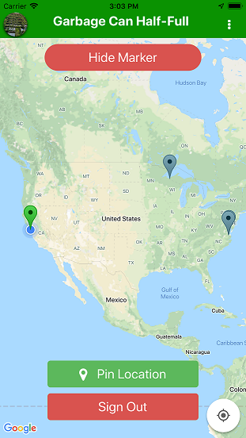

## Description
Garbage Can Half Empty is a cross-platform mobile application built using React Native and available on the Android and iOS platforms.

The application allows users to indicate to their neighbors that they have extra room available in their garbage cans or recycling bins.  The user does this by logging into the application using their Google or Facebook account and sharing their location via the application.  The user then has the ability to show or hide their marker indicating that they do or do not have extra room available.

The application uses a serverless AWS backend to store user location data and status.

## Technologies Used
* [React Native](https://facebook.github.io/react-native/) - React Native lets developers build cross-platform applications using JavaScript
* [Amazon Web Services DynamoDB](https://aws.amazon.com/dynamodb/) - DynamoDB is a NoSQL document store.
* [Amazon Web Services Lambda](https://aws.amazon.com/lambda/) - Lambda lets developers run code without provisioning or managing servers.
* [Amazon Web Services AppSync](https://aws.amazon.com/appsync/) - AppSync is a serverless back-end for mobile, web, and enterprise applications.
* [Amazon Web Services CloudWatch](https://aws.amazon.com/cloudwatch/) - CloudWatch is a monitoring and management service that provides developers with data and actionable insights to monitor their applications, understand and respond to system-wide performance changes, optimize resource utilization, and get a unified view of operational health.
* [GraphQL](https://graphql.org/) - GraphQL is a query language for APIs and was used to connect the mobile application to the AWS backend.
  
  
## Availability
This application is available on [Google Play](https://play.google.com/store/apps/details?id=com.pagodas.shareit&hl=en_US) and the [Apple App Store](https://itunes.apple.com/us/app/garbage-can-half-full/id1451097468?mt=8)
