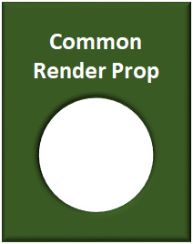

#### Introduction

It can be desirable for a consumer facing product to exist on the web as well as on mobile. For example, many food delivery applications exist as both web and mobile applications.

These applications may even share significant functionality. In the before mentioned example, both the web and the mobile applications would let you place a food order. In fact, they may both perform the same business logic of gathering the order data and sending it to the same backend servers for processing. On the other hand, the two platforms may do some things differently. For example, the mobile application might request the user's location using a platform specific API, while the web app would use the HTML5 [Geolocation API][2].

Also, lets not [miss the forest for the trees here][3]. Occasionally using different APIs to accomplish the same functionality isn't even the primary difference between the platforms. UI presentation and the flow of the UX are a very significant difference.

However, API and UI/UX differences don't mean that you can't share code between the platforms. The React mantra of [Learn Once Write Anywhere][4] still holds weight. Using the Render Props pattern to keep our platform specific primitive components like `` and `` away from component business logic enables significant code sharing across platforms.

#### Purpose

The purpose of this article is straight forward. In it, I will present a technique that allows you to share most of your code across between React Web and React Native applications.

#### Design

**Code Sharing Techniques**

First, let me begin by stating that there are several approaches to sharing code across React platforms. One way is to separate business logic into NPM packages to be imported by individual components. Another method using an SDK is covered in this article [here][5].

Another technique is to create a JavaScript class that extended `React.Component` This parent class would contain all of the the components; non UI related code. The parent can then be extended by a child that contains the platform specific `render` method, and would inherit all the functionality of the parent.

The class technique could be somewhat mimicked using the RenderProps pattern. I'm not going to do a deep dive of Render Props (subsequently refereed to as RPs). To be frank, it took me a while to discover my use case for them. It wasn't until I ran across some good explanations and examples that I realized how helpful they could be (I recommend [Scott Tolinski's series of videos on the subject][6])

Finally, there is no reason you can't just put the business logic in separate functions to be imported and used by components. For example, all the API calls could exist in a file called `APIUtilities.js`. Then a component could import and use the methods contained in that file.

**The Case for RenderProps**

For my use case I wanted to avoid creating and maintaining a large number of NPM modules. In fact, one of my goals was to keep things as simple as possible. Both the class and RP method would satisfy my purposes. In the end, I settled on using RPs for the following reasons.

1. It didn't require maintenance of additional NPM packages
2. RPs have access to React life cycle methods, and I could share those methods across platforms
3. It was time for me to knuckle down and learn the RP pattern

**Planning**

I would create separate folders for each platform as well as an additional folder for any shared items, and then importing and exporting functionality as needed.

The platform folders could contain platform specific code. The `shared` folder would contain any code that would be shared across the platforms. This is where the Render Prop components and my Redux store would live.

What made RPs useful for me was that it enabled separation of all the presentational aspects of a component from its business logic by passing the UI portion of the component as a property to a "wrapping" component. I'll refer to this wrapping component as the Render Prop Component or RPC throughout the rest of this article.

My plan was to build RPCs to do all the component's business logic and then pass it either a mobile or web UI component for rendering. Both UI components would possess the same "hooks" to interact with the logic the RPC contained, and would only (almost) differ in what they showed the user on their screen.

In addition to the RPCs the shared folder would also contain my applications Redux store. Since the store would be mostly the same across platforms, it made sense to keep it there.

Finally, I'd keep other shared utility functions in shared also.

#### Implementation

I began with a folder structure that would support my plan.

A folder for each platform (mobile and web) as well as shared and media folders

Inside the `web` folder I created a new [GatsbyJS][8] project. Similarly, inside the `mobile` folder I created a new [Expo][9] project. Both of these projects do a fine job of describing how to get up and running, so I'm not going to go over those details in this article.

**Configuration**

Both projects would have to reach into the shared folder, and needed a little "help" to make that happen. These issues are related to the React metro bundler's ability to find files, and is discussed [here][10]. An additional discussion pertaining to React Native version 0.57 can be found [here][10].

For the web application which was a GatsbyJS project I had to include the following code in the gatsby-node.js file:

Add this to Gatsby V2 gatsby-node.js file to access shared imports

For the mobile application built using Expo I created a rn-cli.config.js file containing the following code:

Add this to allow Expo projects to access shared imports

And then added the following line to the "`packagerOpts`" section of my `app.json` file:

Ensure the Expo project uses the rn-cli.config.js file

**Building Components**

For this use case, there are several distinct elements of a component.

1. Platform specific wrapping component
2. Platform specific code
3. Common RPC
4. Platform specific render functions

Conceptually, they can be though of according to the image below.

Models of React Web and React Native components sharing code via a common Render Prop

Each element is described below.

**_The Wrapping Component_**

Platform specific wrapping components

1. The completed component wraps everything in a package suitable for use as a component. It is what we think of as a React component and is exported from its file and imported by other components as required.

**_Platform Specific Code_**

Each platform can contain platform specific logic in the component

2\. The wrapping component contains any web specific code. For example, it may include a function that gets the user's location. Different platforms have different APIs to access user location. These platform specific methods exist at this level.

It's important to realize that just because this code is platform specific, it can still have interact with the common code in the RPC. Methods at this level can receive the `renderProps` as an argument which then gives them access to RPC methods. An alternative is to hoist `renderProps` to the wrapping component level shown in item number one using `this.renderProps`.

It can also include any platform specific lifecycle code.

**_Common Render Prop_**

The render prop is common across all platforms

3\. A common RPC (Render Prop Component) that contains common code. Let's continue the location example from item two as an example of common code. We may want to do the same thing with the obtained location no matter how it was obtained. That functionality would exist at this level.

Additionally, the RPC can provide common reactions across platforms in response to lifecycle events.

**_Platform Specific Render Functions_**

Each platform has a different render function to build and present the UI

4\. Platform specific render functions make use of platform specific primitives like `
` and ``, and (if required) UI libraries such as [reactstrap][16] and [NativeBase][17] to present the UI to the user. It can also interact with the `renderProp` that it receives from the RPC to act on code within the RPC. Additionally, it can interact with any platform specific code.

Bringing it all together

**Adding Redux**

Once I confirmed that both platforms could access code inside the shared folder, I set up my Redux store. To do this, I installed the `redux` NPM packaged to all three folders. I additionally installed `react-redux` to both platform folders. I then created the Redux store using from a file that kept in the shared folder, and exported it. Both platforms then imported that store to use in their provider component. Doing this allowed me to only maintain one version of the store across both platforms.

Similarly, I placed the Redux reducers and actions in the shared folder. From there the platform specific code was able to import them as needed.

**Working with Redux and the Renderprop Components**

Maintaining the separation of view and logic meant that my RPs would be responsible to writing to the store. Doing this had the benefit of writing "`this.props.dispatch`" one time vice doing it twice for each platform. I also knew that once I was satisfied with store manipulation on one platform, I'd likely be just as satisfied on other platforms.

However, while the store existed in the shared directory, it was imported by each platform separately and provided to each platforms root component using the `` component from react-redux. This resulted in the platform "owning" Redux's dispatch and connect functionality. To summarize, the platform UI components would have to connect to the Redux store, not the RP component.

This problem can be solved by connecting the platform UI component, and then passing `this.props.dispatch` and `actions` to the RP as shown below:

Enabling communication between Redux, the RPC, and platform specific code

The shared RP can then dispatch actions and manipulate the store just like any other component.

Packages that required setup during runtime were handled in a similar manner. For example, Amazon Web Service's Amplify service requires initialization at application start. Amplify was used in both the web and mobile apps, so it made sense to work with it via the RPs; however, the RPs do not automatically have access to the initialized, application specific Amplify instances. This problem can be solved by passing the relevant Amplify specific functions to the RP as shown below. In this case, passing the functions gives the RP the ability to make API calls for both platforms.

**NPM Package Installations**

One thing to keep in mind is the interaction of NPM packages between the various platforms and the shared directory. I ended up installing packages to each platform's directory, and the shared directory as needed. For example, React Native specific testing libraries would be installed to the mobile platform only. Gatsby was installed to the web platform only. Packages that were required by the shared RPs or shared utilities were installed to the shared folder as required.

Bottom line: install packages as needed by each "branch" of the project; web, mobile, shared, etc.

#### Conclusion

So far the RP pattern has proven an effective way to share code and functionality across platforms. While it does take additional work to recall project organization, I've drastically cut down on the amount of code I've had to write and created a shared testing target for my most complicated code.

[2]: https://developer.mozilla.org/en-US/docs/Web/API/Geolocation_API
[3]: https://www.dictionary.com/browse/can-t-see-the-forest-for-the-trees
[4]: https://reactjs.org/blog/2015/03/26/introducing-react-native.html
[5]: https://hackernoon.com/share-code-between-react-and-react-native-using-sdk-85c2dab552f8
[6]: https://www.youtube.com/watch?v=3ic-f1AYLWU

[8]: https://www.gatsbyjs.org/
[9]: https://expo.io/
[10]: https://github.com/facebook/metro/issues/7
[16]: https://reactstrap.github.io/
[17]: https://nativebase.io/