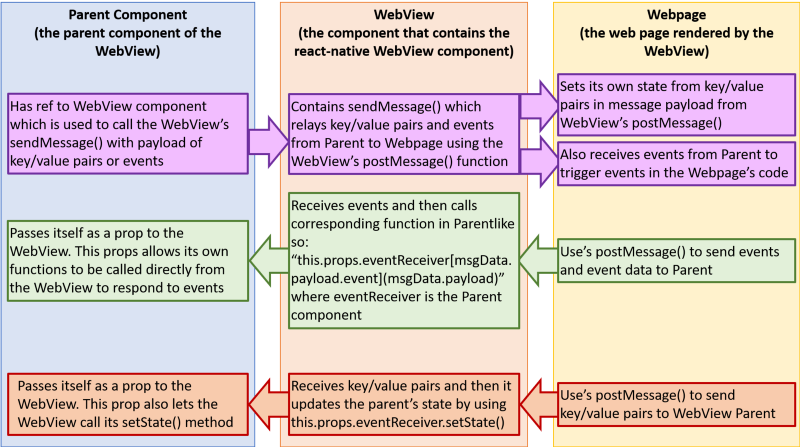

#### Introduction

Programmers are frequently afflicted with what I call "there must be a better way" (TeMBaW) syndrome. TeMBaW frequently occurs when you successfully accomplish something new to you. However, after that initial sense of accomplishment, some nagging details start rearing their head like that tickling scratchiness in the back of your throat before you get sick. You may go back to the code you wrote, and start getting hints of the [code smell][2] you previously ignored. Or, at some later point, you may just realize that some new skill you've acquired could offer significant improvement on previously "completed" projects.

My [react-native-webview-leaflet][3] package afflicted me with a severe case of TeMBaW. Sure, it did it's job; it displayed a [Leaflet][4] map in a React Native component. It even did some things that the [react-native-maps][5] component didn't do like provide support for CSS animation of markers, and customized markers including SVG and emojis. However, it suffered from what I felt were several problems, most of which existed because a lack of experience during its creation meant that I just didn't know then what I know now.

And what I knew now (well, at least suspected) was that by using [react-leaflet][6] inside a React Native WebView along with some thoughtful function names, I could share state and functions between my React Native application and the Leaflet React component. It also occurred to me that this technique would be applicable to vanilla JavaScript pages.

This article will explain that technique. Specifically, I will show how the webpage rendered by a React Native WebView can "call" a React Native function and update the React Native component's state. I will also show how the React Native component can call the webpage's functions as well as update the webpage's state.

#### Problem

The React Native WebView and the webpage need to communicate. This means they need to "speak" and "listen" to each other. The communication also needs to be meaningful, simple, and compact. The bottom line is that I don't want to write a lot of code enable concise communication between the two components.

Though this problem was solved in my previous article, I felt there was a better way. That previous technique is detailed in [Accepting Payments in a React Native App,][7] so I won't rehash it here. I will say that it involved a lot of "translation" in the WebView component to support communications between the webpage and the WebView's parent. Eliminating this translation and minimizing the WebView's middle man role were the primary goals of this new technique.

#### Implementation

Remember that the webpage is just that, a webpage. As such it has access to the document object in the HTML DOM. In order for the webpage rendered by the WebView to "hear", we add an event listener to the document so that it can hear message events like this.

`document.addEventListener('message', this.handleMessage)`

To talk it uses the `document.postMessage` in response to component events. The sequence starting from handling an event to sending a message in shown in the GitHub gist below:

Sending a message from the webpage to the WebView

On the other side of the conversation, the RN WebView hears via its `onMessage` prop which can call a function and pass the message as an argument. It talks by using the `postMessage` function that can be accessed by a `ref` to the WebView component, and takes the message as an argument.

There are two significant caveats to this conversation.

1. All messages must consist of strings. Fortunately, `JSON.stringify` and `JSON.parse` simplify the process of converting objects to and from strings .
2. Other people use this communication path just like an old-fashioned [party line telephone system][8]. Just like then, we can include a prefix in our messages to ensure the components know what to listen for and what can be ignored.

So, how do we call a function and how do we set state? First I'll discuss webpage to RN WebView communication, then I'll talk about the other direction.

#### Webpage to WebView Communication

We can make the WebView component react to an event emitted by the webpage through thoughtful use of event and function names. For example, a Leaflet map emits an `onLoad` even when it has completed loading. When that event occurs, the webpage builds an object that includes that event name, any parameters that may accompany that event, and an application specific prefix. Then we can use `JSON.stringify` to turn that message into a string, and send it to the WebView via a call to `postMessessage`.

The WebView then receives the message and applies `JSON.parse` to it in order to recreate the original object. Recall that this object has an `event` key that has the event's name as it's value. At that point, we can use the `event` value to call a function in the WebView component or even the parent component.

The first example below shows how to call a function in the component containing the WebView. This function has the same name as the `event` value that is contained in `msgData.payload` which is the parsed message object that was sent by our webpage. The second example calls a function in the `eventReceiver` component passed as a prop to the WebView.

`this.[msgData.payload.event](msgData.payload)`

`this.props.eventReceiver[msgData.payload.event](msgData.payload)`

Setting state works similarly. An absence of the `event` key in `msgData` can tell us that this message is not an event, and that it contains data that should be used to update state. Both of these concepts are shown in the GitHub gist excerpt below.

The WebView receives a message from webpage it renders

#### WebView to Webpage Communication

On the other hand, let's say that the `eventReceiver` component wants to communicate with the WebPage. In this situation, the eventReceiver is essentially using the WebView to do the talking by creating a `ref` to the WebView, and calling its `postMessage` function.

The ref is created like this:

`ref={(component) => (this.webViewLeaflet = component)}`

And a message can be sent like this (in this case, configuration options are being passed to a react-leaflet map).

`this.webViewLeaflet.sendMessage({ zoom: 6, locations: this.state.locations, showAttributionControl: this.state.mapState.showAttributionControl, showZoomControl: this.state.mapState.showZoomControl });`

At that point, the communication from the WebView to the webpage works essentially the same way as demonstrated in the above gist as long as you have a React component in your webpage.

One of the benefits of using React in your page is reactive to state, so a simple call to `setState` can have the same effect as multiple functions or can behave like an event thanks to the `componentDidUpdate` and `getDerivedStateFromProps` life-cycle functions.

Otherwise, if you're using plain vanilla JS you can create functions in the WebPage's code and then send messages with `event` keys corresponding to the name of functions.

Taken all together, the communication flow can be summarized by this diagram.

#### Conclusion

This technique vastly simplified my code. It replaced the large switch statements I previously used to route communication with simple calls to functions with names that matched variables in the passed message. This improvement was a case where TeMBaW resulted in a better product, and easier path to creating similar components in the future.

[1]: https://cdn-images-1.medium.com/fit/c/100/100/1*1yM3mXERk3SnRW2o_hh_Kg.jpeg
[2]: https://en.wikipedia.org/wiki/Code_smell
[3]: https://github.com/reggie3/react-native-webview-leaflet
[4]: https://leafletjs.com/
[5]: https://github.com/react-community/react-native-maps
[6]: https://github.com/PaulLeCam/react-leaflet
[7]: https://medium.com/react-native-training/accepting-payments-in-a-react-native-app-part-4-cb4f7c02c193
[8]: https://en.wikipedia.org/wiki/Party_line_%28telephony%29
[9]: https://cdn-images-1.medium.com/max/1600/1*C-UrhoF02qgxUUYQE4K3qg.png

  