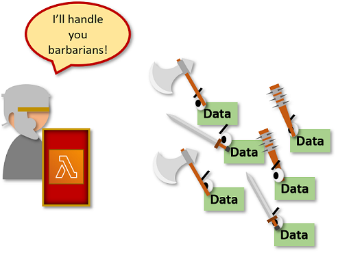
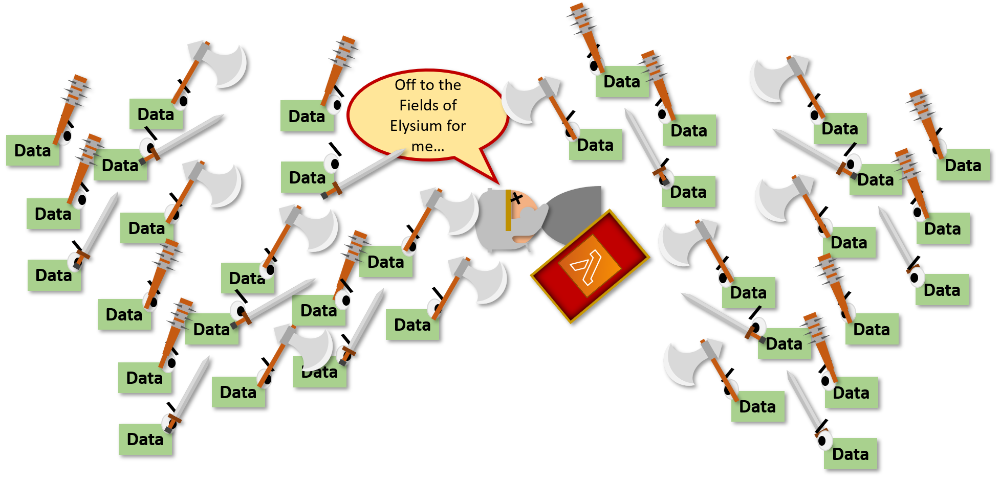
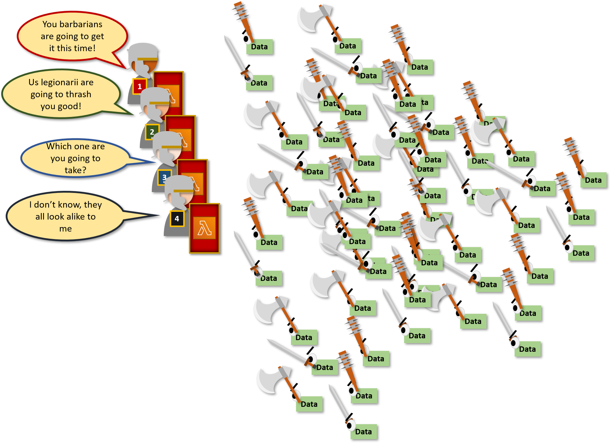
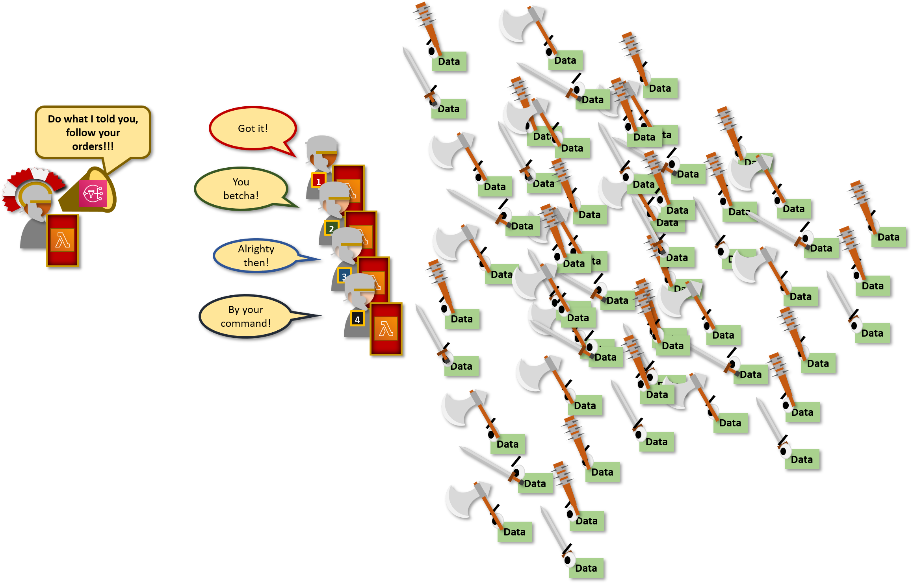
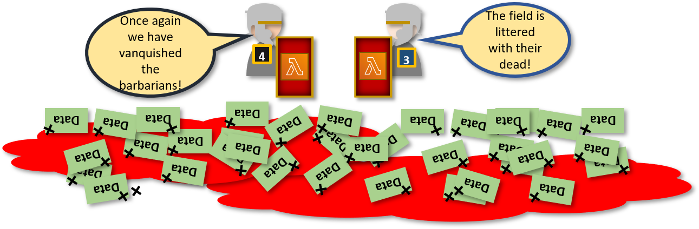

#### Introduction &amp; Purpose

I am currently working on a full-stack application that is dependent on data that must be imported from multiple sources, compared with data the user inputs from the client, and then return the results of that processing for the user to view. This article focuses on the serverless techniques I used to process that data and return it to users&#39; mobile devices. Throughout this article, I refers to the serverless data processing portion of this stack as the back-end.

#### Background

My application relies on Amazon Web Services' Lambda for data fetching and processing.  AWS Lambda is a Functions as a Service (FAAS) product that lets the user run arbitrary code on demand.  FAAS services are becoming popular tools to run code without the need to provision equipment. They are great for processing individual pieces or even large batches of data. However, by their very nature, they cannot run forever, and they will be killed after a given amount of time.  What if you need to do processing that takes more than the 15-minute lifecycle of an AWS Lambda (or similar FAAS product)?

One way to avoid the issue of one Lambda running out of processing time is to divide the work and process it among multiple instances of the same Lambda.

_How are Roman Legionaries like AWS Lambdas? Read on to find out._

#### Design & Implementation

Why would I need to worry about processing large quantities of data?  Lambda functions are currently [capped at 15 minutes of run time](https://aws.amazon.com/about-aws/whats-new/2018/10/aws-lambda-supports-functions-that-can-run-up-to-15-minutes/). Before October of 2018, they were capped at 5 minutes.  A 15-minute runtime is very generous for most requirements, and given the upward movement in duration, I would not be surprised if there were more increases in the future.  However, the current limitation is 15 minutes, which means that any reading from data-stores, processing, writing results, sending user notifications, etc. must be done within that time period.

The chances are small that one of my projects may require that much processing time, and I am not a fan of premature optimization.  As they say, the best app is one that is being used.  However, I do like to mitigate risk when I can, so I decided to tackle this particular risk as part of the initial design.

##### Divide and Conquer

For this example, I'll be processing data related to geographic locations that users supply to my back-end via a mobile application.  These locations are first stored in a database and from there are read, processed, and written back to the same data-store by.  Additionally, notifications are sent to mobile users based on the results of that processing.  Finally, this processing is done repeatedly at timed intervals.

_This group of data is no matched for one well trained Lambda Legionary_

Let us say the application becomes popular, and the application receives an overabundance of user locations (what a great problem to have). I would need some way to divide this massive number of locations so that they could be processed in smaller batches by multiple shorter Lambdas vice one large chunk by a single long-running (potentially too long running) Lambda.

_However a horde can overwhelm event the best Lambda Legionary._

To do this, each location is assigned a random number between 0 and 99.  I&#39;ll refer to this number as the location&#39;s bin number.  The bin number is included in the location record and can be accessed just like any other piece of location information.  Additionally, the NoSQL data-store that I am using (DynamoDB) uses the bin number as one of its indexes which enables scanning vice query retrieval.  Bin numbers are randomly assigned meaning that multiple records will have the same bin number, and not all bin numbers will actually be used initially.  However, given a large enough set of location records, there should be a pretty uniform distribution of records to bin numbers.

When a Lambda processing step requiring user locations is triggered, it retrieves data from the location data-store.  However, instead of retrieving all the user locations records, it only pulls the ones with a particular bin number.  

_Divide and conquer is the best strategy, but organized teamwork is crucial._

The size of each bin can be controlled by a variable in the Lambda function that prescribes the total number of bins.  For example, with 100 pieces of data, I can prescribe two Lambda Legionaries, which makes individual bin size 50 pieces of data. This means that the next processing step only has to work on half of the user location records.  Similarly, I can dictate that there be four Lambda Legionaries which results in the next micro-service having to only process a quarter of the total records.

In my architecture, follow-on micro-services receive instruction on which bins to process via the AWS Simple Notification Service (SNS). SNS receives and relays a message containing the bins (or even single bin) the Legionary is supposed to attack.  SNS is just a relay, it receives the message and then triggers the follow-on Lambda, so how does SNS get this message? It receives it from a Lambda that acts as the [Legatus legionis](https://en.wikipedia.org/wiki/Legatus_legionis); the legion commander.  In summary, the Legatus legionis Lambda prescribes the tasking for the Legionary Lambdas, and SNS is his horn to shout those instructions to the Legionaries

The Legatus legionis contains information about the desired number of bins and does the math to determine which bins will be assigned to each legionary.

For example, the following parameters …

- 100 total pieces of data
- 4 Lambda Legionaries (prescribed via a variable in the orchestrator)

…results in four messages that include the following information (along with a message ID, etc.)

1. Message 1: &quot;binStart=0, binEnd=24&quot;
2. Message 2: &quot;binStart=5, binEnd=49&quot;
3. Message 3: &quot;binStart=50, binEnd=74&quot;
4. Message 4: &quot;binStart=75, binEnd=99&quot;

The orchestrator then sends the bin numbers in a message to SNS, which triggers the follow-on Lambda.  This next Legionary receives &amp; processes the message, and knows which range of bins to retrieve from the location store.

_Somebody has to be in charge and give orders, and that is the Legatus Legionis Lambda._

This process allows one to control the total number of records a Lambda has to process.  It also provides the ability to reduce the number of records each Lambda process by increasing the number of legions, number of bins or both. Both of which can be done without affecting the client application.

#### Conclusion

This technique presents a viable method of avoiding the Lambda maximum runtime.  However, there are increases in complexity. For example, a single monolithic Lambda would not require notifications.  Also, a bin number must be given, and the data-store should be searchable via that bin.  However, if you&#39;re in a situation when you&#39;re worried that the given processing time limit might not be enough, this technique could be a useful alternative for you.