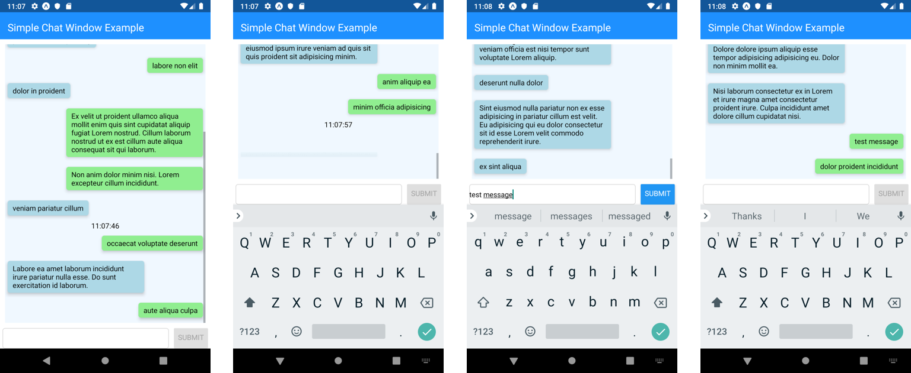

### Background


The component tested in this article is a simple and functional React Native chat component. It allows a user to input text, press a submit button, and see that text show up in a scrolling message window. The component also simulates a conversation by randomly inserting "Lorem Ipsum" text into the scrolling window on timer set in the code.

Video of the component can be found viewed at https://www.youtube.com/watch?v=neWMYiCyleI&feature=youtu.be
The code for the component shown in the video is available at on GitHub at https://github.com/reggie3/react-native-simple-chat

Please note, this article presents an integration test and assumes the reader has previously used Jest to render and test React or React Native components.

### What to Test

Component requirements are a good starting point when determining what to test. In the case of a simple chat component, the high-level requirements are fairly straight forward. The component should do the following two things:

<ol type="a">
  <li>Display the conversation</li>
  <li>Let the local user add a message to the conversation</li>
</ol>

Furthermore, item "b" could be broken down into the following more specific requirements:

<ol id='chatRequirementsList'>
  <li class='empty'>The message input box should be empty when the user enters the screen</li>
  <li class='empty'>The submit button should be disabled when the user enters the screen</li>
  <li class='empty'>User can type a message into the input box</li>
  <li class='empty'>They can press a submit button to add their message to the conversation</li>
  <li class='empty'>The new message should be displayed in a message scroll box</li>
  <li class='empty'>The submit button should be disabled if the user has not typed anything into the input box</li>
  <li class='empty'>The submit button should be enabled if there is content in the input box</li>
  <li class='empty'>Text should be removed from the input box after the user presses the submit button</li>
</ol>

These requirements are demonstrated in the following picture.


While unit tests could be written to ensure each individual element involved in the requirement, the level of interaction between multiple elements makes this requirement a prime candidate for integration testing. The interactions and requirements described above can all be tested with a single integration test.

### Tools

There are a multitude of tools available to support React Native testing. This article uses the following subset:

<ul>
  <li><a href="https://jestjs.io/">jest</a> for running our test</li>
  <li><a href="https://github.com/testing-library/native-testing-library">@testing-library/native-testing-library</a> to provides an intuitive framework for testing React Native components</li>
  <li><a href="https://github.com/testing-library/jest-native">@testing-library/jest-native</a> to provide several helpful React Native assertion tools that we can test against</li>
</ul>

### Implementation

#### Step 1: Render the Parent Component

The test begins by rendering the ChatComponent component.

```javascript
describe("ChatComponent", () => {
  it(`should take a value from input, and show it in the chat window
  & remove the input text from the input box upon submit`, async () => {
    const testMessage = "test message";
    const {
      getByTestId,
      getByText,
    } = render(<ChatContainer />);
```

The `render` function is imported from `"@testing-library/react-native"`. In addition to the `getByTestId` and `getByText` functions that are shown, render provides several other useful functions that are documented at https://www.native-testing-library.com/docs/api-queries

These different query functions make it possible to find the different elements that React Native renders as part of the give n component. In this case we'll be using the `getTestId` to find components that include the `testID` prop with a given value. Similarly, `getByText` can be used to find components containing a given string of text.

#### Step 2: Get Handles to Components as Needed

Next, we get handles to the child components we are interested in testing and interacting with:

```javascript
const messageScrollView = getByTestId('messageScrollView');
const messageInput = getByTestId('messageInput');
const messageSubmitButton = getByTestId('messageSubmitButton');
```

Notice that we're using `getByTestId` go find the components we wish to interact with. The `testID` prop is just like any other React prop and can be added to a component like this:

```javascript
<ScrollView
  /* some other props */
  testID="messageScrollView"
  >
```

Now that we have handles to what we need, let's use them.

#### Step 3: Fire Events and Assert Expectations

The next step is to interact with components and confirm or deny expected behavior based on the list of requirements.

For example, the following two requirements:

1. The message input box should be empty when the user enters the screen
2. The submit button should be disabled when the user enters the screen\

Can be tested with these two lines:

```javascript
expect(messageInput).toBeEmpty();
expect(messageSubmitButton).toBeDisabled();
```

This step is where the `@testing-library/jest-native` starts to demonstrate its usefulness. It contains the `toBeEmpty` and `toBeDisabled` functions used. These functions are an example of smart naming because they do exactly what they say.

Next we'll move on to test these requirements:

3. User can type a message into the input box
4. The submit button should be enabled if there is content in the input box

by using `fireEvent` from `@testing-library/react-native` to place a test message into the input box:

```javascript
// type our text message in the input box
fireEvent.changeText(messageInput, testMessage);
```

and confirm that the submit button is now enabled:

```javascript
// submit button should be enabled now that there is text in the input box
expect(messageSubmitButton).toBeEnabled();
```

which satisfies requirement number 7.

We then "press" the "Submit" button:

```javascript
// press the submit button
fireEvent.press(messageSubmitButton);
```

and confirm that our test message is displayed on the page by using the `getByText` method to find the text in the rendered component

```javascript
// we expect to find the test text message on the page
expect(getByText(testMessage)).toBeTruthy();
```

Even better, we can confirm that the ScrollView component containing the conversation specifically renders an element containing the test message:

```javascript
// in fact, we expect the scroll view to have a child element containing
// the test message as text
expect(messageScrollView).toContainElement(getByText(testMessage));
```

This satisfies requirments 4 and 5.

Finally, we confirm requirements 6 and 8 are satisfied with the following assertions:

```javascript
// also expect the input box to be empty and the submit button to be disabled
expect(messageInput).toBeEmpty();
expect(messageSubmitButton).toBeDisabled();
```

And that's it, we've written a test that check for all the requirements and should confirm behavior if the tests pass.

#### Step 4: Run the Test

Now we can give the test a go by typing `jest` and seeing what happens.

```
PS C:\Users\regin\Dropbox\react-native-simple-chat> jest
 PASS  src/ChatComponent.test.tsx
  ChatComponent
    √ should take a value from input, and show it in the chat window
  & remove the input text from the input box upon submit (110ms)

Test Suites: 1 passed, 1 total
Tests:       1 passed, 1 total
Snapshots:   0 total
Time:        4.099s, estimated 6s
Ran all test suites.
```

There we have it, a passing test.

#### But wait, how do we know it's working right?

Well, a test that can't fail is worse than no test at all. In fact, if we were using Test Driven Development (https://www.youtube.com/watch?v=6pYUzEduLyU) we would have written the tests first, saw that they failed, and then written the code to make the tests pass. TDD would have given us confirmation that the tests could fail from the very beginning

Since this example does not follow TDD, our alternative is to change tests so that they can fail and then run the test to confirm that it does.

So, let's change the text we are looking for in the scroll view by asserting that we expect to find a string that is different from the test message that we type in.

```javascript
expect(messageScrollView).toContainElement(getByText("Can't touch this"));
```

Running the test with that change results in a test failure accompanied by the following helpful message:

"Unable to find an element with the text: Can't touch this. This could be because the text is broken up by multiple elements. In this case, you can provide a function for your text matcher to make your matcher more flexible."

So there you go, tests can in fact fail.

### Conclusion

This was a very brief example of the effectiveness of integration testing to test complex interactions that are described by multiple requirements. Additionally, this example demonstrates that integration tests are especially useful at testing interactions in a way that unit tests may not support.

Integration testing is just one portion of the testing trophy that Kent C. Dodds writes about and refers to extensively (https://kentcdodds.com/blog/write-tests). I recommend referencing his blog posts, videos, and the course https://testingjavascript.com for more information.
