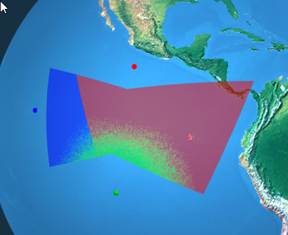
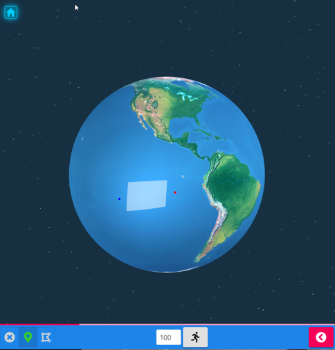
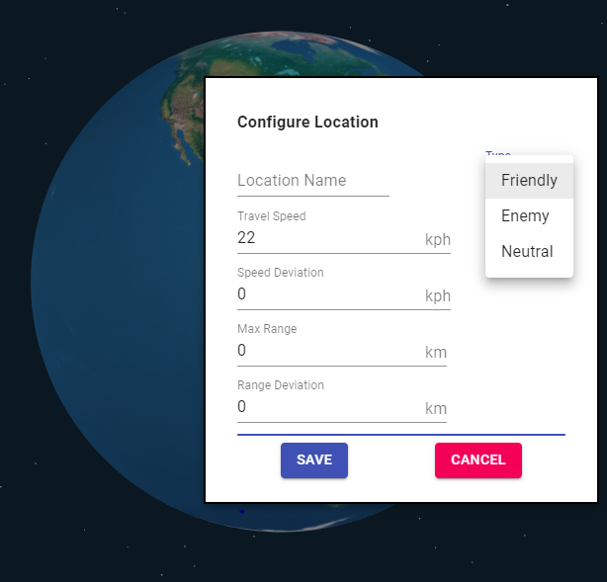
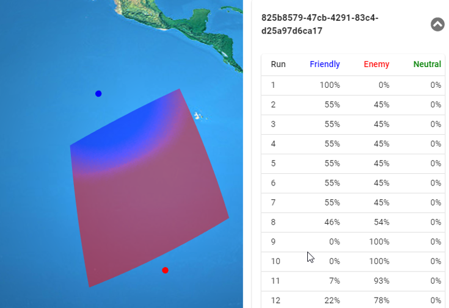

import { Link as GatsbyLink } from "gatsby"

### Background

A long time ago I needed to find the answer to a problem that could be summarized as follows:

> Given various starting locations for multiple competing entities, speed of travel for assets positioned at those starting locations, and a given area of interest, which portions of the area(s) of interest are reached first by which of the entities."

This seemed like the perfect use case for a map-based data visualization that incorporated some statistics to model variations in asset speed.  Fortunately, I was taking classes on those subjects at the time.
The code for the original data visualization is available in this Github repository: https://github.com/reggie3/Capstone-GetThereFirst 

The last commit to that repository was made over five years ago and uses the technologies available at that time.  A quick dive into that codebase reveals some jQuery, Bootstrap, and vanilla Three.js.

Fast forward a few years, and there are new tools available that justify updating the project.  In this updated version jQuery has been replaced with React, Bootstrap has given way to [Material-UI](https://material-ui.com/), and Three.js is augmented with [react-three-fiber](https://github.com/react-spring/react-three-fiber)

A user can place a location marker and set several variables to be used in the process of calculating results.

After running the analysis, results can be seen on the analysis area as well as in a table.

This image shows the result of multiple runs and includes a maximum range for the blue base in the north.
