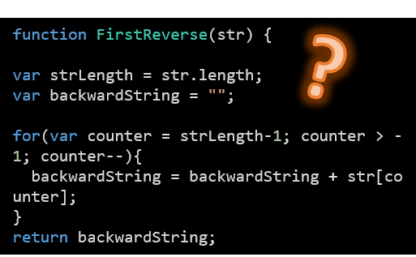

### Background

There are numerous articles available on how to think like a programmer. A quick Google search of “how to think like a programmer” yields more than 95 million results:


However, when I’m developing code that is meant to solve a problem, or just plain do something; I try to think the way the code would think when accomplishing the problem. While a search for “how to think like a program” yields even more results, those results are actually focused on “how to think like a programmer” which does not quite mean the same thing as “how to think like a program”


This article is my attempt to throw a pebble into that hole as a starting point to filling it. It will explain why you might want to think like a program, how to do it, and how it results in creating an algorithm. This article won’t discuss design patterns, or any advanced programming concepts, and it will not teach you how to code. The primary audience is people who are beginning to learn how to code, commonly referred to as “Code Newbies” and are aware of concepts like variables, for loops, and if statements.

### Why Think Like a Program?

When a person is given a task, they usually must think of a way to accomplish it or they already know how to do it based off intuition, education, experience, etc. For example, a person told to dig a 10-foot-deep hole knows they will need a shovel and some way to measure the depth of the hole. They also know they have a lot of work to do. Humans already understand the concepts of tools, dirt, digging, etc. In summary, when given a task, humans think like humans.

Computers are not so fortunate. They just aren’t as smart as people are (yet). Not only do they not have a way to manipulate a shovel, but they also don’t even know what one is. Computers just don’t “think” the same way people do. They don’t have intuition, education, experience, etc. (usually they don't; this article isn’t talking about Artificial Intelligence or Machine Learning).

What computers do possess are a set of skills they are particularly good at, and a tireless ability to perform those skill the same way each time. As a programmer you connect those skills in a way that accomplishes a desired task.

In summary, thinking like a program involves identifying applicable computer skills and arranging them in a way that accomplishes the desired task. An algorithm is created when these skills are identified and arranged in order to accomplish a task.

#### The Four Computer Skills

All computers are good at four basic things:

1. Memorizing information: variables and their “contents”
2. Basic math: counting, addition, subtraction, multiplication, division
3. Consistently performing repetitive task: loops
4. Conditional logic: if this thing happens, then do this other thing; else do something else

   Note: this is not a comprehensive list of everything computers are good at.

A program is the arrangement of the execution of these four skills in a way to accomplish a given task. Figuring out the correct arrangement requires thinking like a program.

#### Example

To see this in action, let’s talk about digging that 10-foot hole I wrote about earlier:

As a human, first I would obtain a tool to dig with. Then I would start digging. Initially, I would just dig as fast as possible to get the job done sooner. I would not even bother measuring the depth of the hole until I thought it was almost 10 feet deep. Once I judged that I was close to finish, I would start measuring the depth and dig based on the results of that measurement. Then, once I got to the desired depth, I would stop digging.

Now, let us pretend we are a program, and our job is to dig a hole. As a program how do we do that?
First, let’s start by making a list of what human me did to dig the hole.

1. As a human, first I would obtain a tool to dig with.
2. Then I would start digging.
3. Initially, I would just dig as fast as possible to get the job done sooner.
4. I would not even bother measuring the depth of the hole until I thought it was almost 10 feet deep.
5. Once I judged that I was close to finish, I would start measuring the depth and dig based on the results of that measurement.
6. Then, once I got to the desired depth, I would stop digging

Next, I try to think in terms of the four skills I identified above.

Computer Skill 1: Memorizing: What are some things we might want to memorize in order to accomplish this task?

> - How deep the hole should be when we finish.

> - How deep the hole is when we measure it while we are digging.

Computer Skill 2: Basic Math: Are we counting anything? What about adding, subtracting or other math?

> - We are adding to the depth of the hole each time we shovel dirt from it.

Computer Skill 3: Consistently performing repetitive task: Are there repetitive actions?

> - We repeatedly dig dirt from the hole.

Computer Skill 4: Conditional logic: Is there any logic involved here?

> - We keep digging until the hole is 10 feet deep, and we stop digging once it is.

As you can see, the example of digging a hole requires the use of all four computer skills. As humans, we internalize each of the skills. However, programmers write programs to explicitly do the steps required for the task. This explicit identification and arrangement results in an algorithm.

#### Let's Turn That Into Code

Given a little bit of prior coding knowledge we can connect what we just created to some common programming constructs such as variables, loops, and conditionals to create some code:

```js
// Skill 1, memorize some stuff
var currentDepth = 0; // keep track of how deep are we now in feet as we dig
var desiredDepth = 10; // how deep do we want to get in feet

// Skill 3 and Skill 4: create a loop that will keep going until we reach the desired depth
while (currentDepth < desiredDepth) {
  // dig some amount for example 1 foot and each time we dig, add 1 foot the tracked depth
  currentDepth == currentDepth + 1; // Skill 2: count the depth
}
```

#### Conclusion

We have all heard something along the lines of "Computers only do what they are told.". Programmers make computers do tasks by writing programs, and by telling the program "what to do" we make the computer "do the thing". In the computer world and in the real world; communication is made easier and more effective if you can think like the recipient of your message. In this case thinking like a program helps us achieve our final goal of making the computer do what we want it to do.
